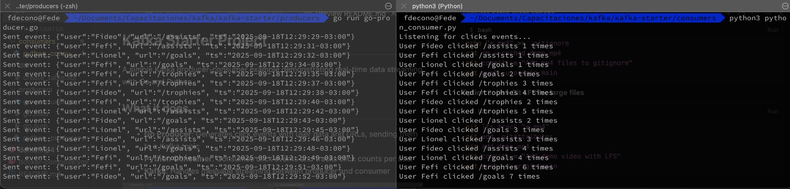

# Kafka Starter Project

A simple Kafka producer-consumer example demonstrating real-time data streaming with Go and Python.

## What it does

- **Go Producer**: Generates click events with user data and URLs, sending them to a Kafka topic
- **Python Consumer**: Consumes click events and tracks click counts per user
- **Kafka**: Handles message streaming between producer and consumer




## Prerequisites

- Docker and Docker Compose
- Go 1.23+
- Python 3.11+
- pip3

## Quick Start

1. **Start Kafka**
   ```bash
   docker-compose up -d
   ```

2. **Install Python dependencies**
   ```bash
   pip3 install kafka-python
   ```

3. **Run the consumer** (in one terminal)
   ```bash
   cd consumers
   python3 python_consumer.py
   ```

4. **Run the producer** (in another terminal)
   ```bash
   cd producers
   go run go-producer.go
   ```

## Project Structure

```
kafka-starter/
├── docker-compose.yml      # Kafka + Zookeeper setup
├── producers/
│   └── go-producer.go      # Go Kafka producer
├── consumers/
│   └── python_consumer.py  # Python Kafka consumer
└── db/
    └── create_table.sql    # Database schema
```

## Expected Output

**Producer**: Sends JSON events like:
```json
{"user":"Fefi", "url":"/goals", "ts":"2024-01-15T10:30:00Z"}
```

**Consumer**: Displays click tracking:
```
User Fefi clicked /goals 1 times
User Lionel clicked /assists 1 times
```

## Stop Services

```bash
docker-compose down
```
